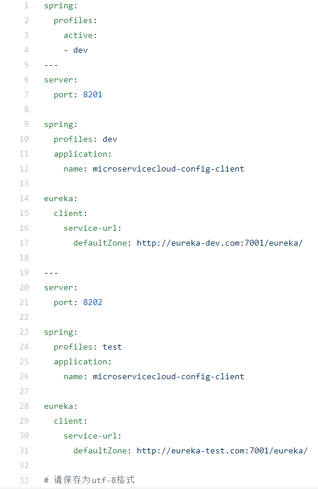

###SpringCloud config客户端配置与测试
1. 在`microservicecloud-config`的GitHub本地库路径下`（D:\develop-user\idea\microservicecloud-config）`新建文件`microservicecloud-config-client.yml`
2. `microservicecloud-config-client.yml`的内容 

3. 将以上配置文件提交到GitHub中，git命令如下：
    
    `git status`  `查看本地库文件状态`
    
    `git add .` `提交到暂存区` 
    
    `git commit -m "提交信息"` `提交到本地库`
    
    `git push origin master`  `提交到远程库主分支`
    
4. 新建`microservicecloud-config-client-3355`并添加maven依赖（见3355项目的pom.xml）
5. 新建`bootstrap.yml`和`application.yml`文件，其中：
    
    `bootstrap.yml` 是用户级的资源配置项
    
    `application.yml` 是系统级的资源配置项，优先级更加高
    
    Spring Cloud将创建一个`Bootstrap Context`，
    作为Spring应用程序的`Application Context`的父上下文。
    在初始化期间，`Bootstrap Context`负责从外部源加载配置属性并解析配置。这两个上下文共享从外部获取的`Environment`。`Bootstrap`属性具有高优先级，默认情况下不会被本地配置覆盖。`Bootstrap Context`和`Application Context`有不同的约定，所以新增了一个`bootstrap.yml`文件。确保`Bootstrap Context`和`Application· Context`配置的分离。
    
6. windows下修改hosts文件，增加本地域名解析映射`127.0.0.1 client-config.com`
7. 新建rest类，验证是否能从GitHub上读取配置。
8. 新建主启动类`ConfigClient_3355_StartSpringCloudApp`
9. 测试

        1.启动Config配置中心3344微服务并自测  http://config-3344.com:3344/application-dev.yml
        2.启动3355作为client访问准备
        3.bootstrap.yml里面的profile值是什么，决定从GitHub上读取什么
           
            假如目前是profile:dev
                dev默认在GitHub上对应的端口就是8201
                http://client-config.com:8201/config  
           
              假如目前是profile:test
                             dev默认在GitHub上对应的端口就是8202
                             http://client-config.com:8202/config       
###成功实现了客户端3355访问SpringCloud Config3344通过GitHub获取配置信息                

###SpringCloud Config配置实战
1. Config服务配置OK且测试通过，我们可以和config+GitHub进行配置修改并获得内容。
2. 此时我们做一个eureka服务+一个Dept访问的微服务，将两个微服务的配置统一由GitHub获得实现统一配置分布式管理，完成多环境的变更。
3. git配置文件本地配置
    
    在配置中的git本地仓库新建`microservicecloud-config-eureka-client.yml`和`microservicecloud-config-dept-client.yml`配置文件并提交到GitHub
    
4. Config版的eureka服务端
      
      新建`microservicecloud-config-eureka-client-7001`，并修改pom.xml添加yml文件及主启动类后测试
      
      先启动`microservicecloud-config-3344`微服务，保证Config总配置是OK的；再启动`microservicecloud-config-eureka-client-7001`微服务
      http://eureka7001.com:7001/
5. Config版的dept微服务 

